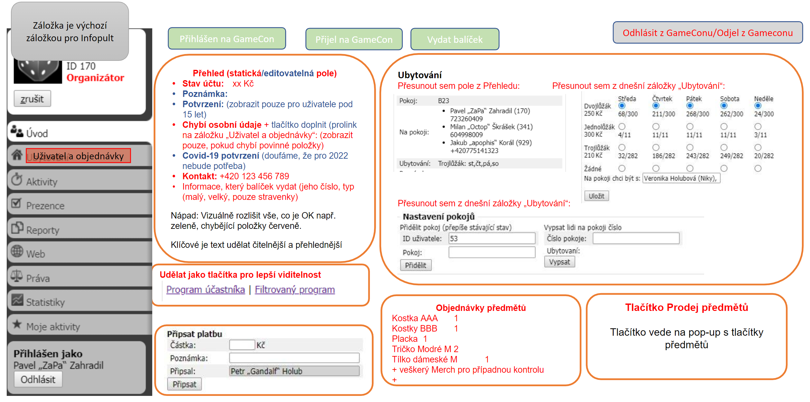
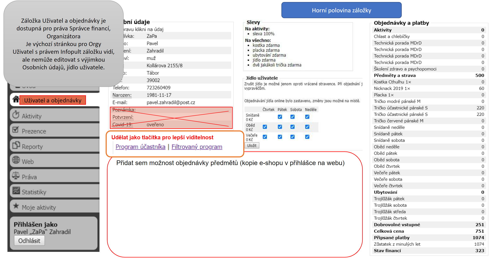
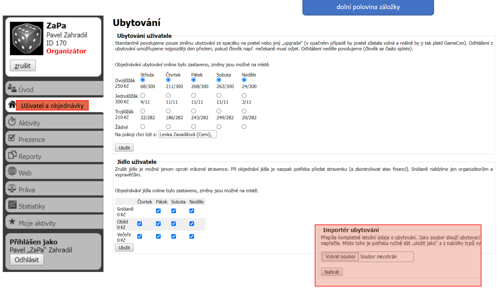
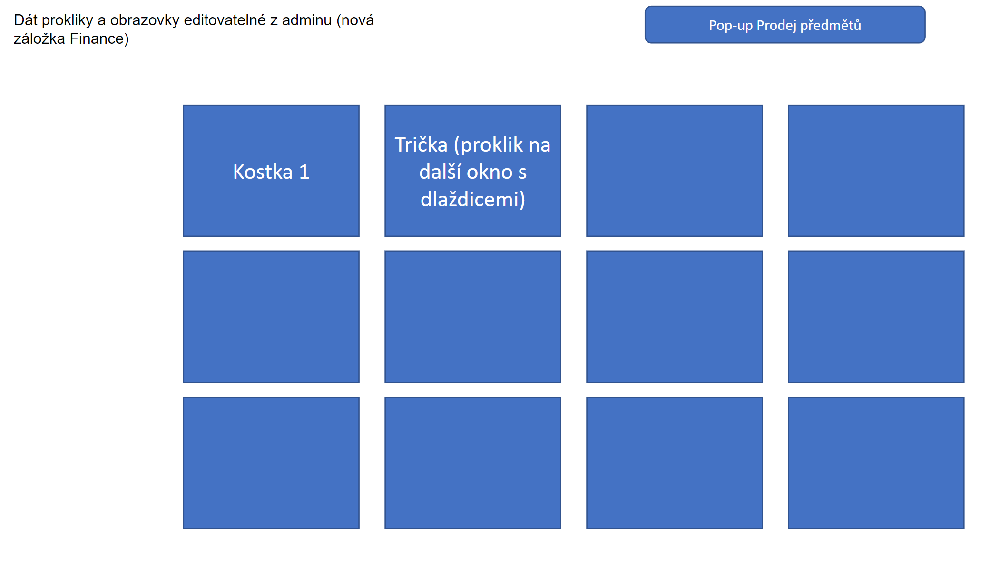

[zadání](https://docs.google.com/document/d/1be-iH5z5Xb_a5mG69Yv_1AzJe82kuwXym_iCpz838jQ)

# Infopult

- [ ] Infopult
  - [X] Přejmenovat úvod na infopult
  - [X] Tlačítka
    - [X] tlačítko Přihlásit na GC
    - jiné PR, komplikovaná logika
    <s>
      - tlačítko Přijel na GC
        - *(optional)* Kontrola povinných polí
    </s>
    - [X] tlačítko Vydat balíček
    - [X] Odjel z GC
    - [X] tlačítko Odhlásit z GC

    - jiné PR, komplikovaná logika
    <s>
      - *(optional)* Reversovatelné akce z židle "finance"
    </s>
    - [X] Řešení komunikace aktuálního stavu a stavů tlačítek s uživatelem *(klikatelné, kliknuté, nekliklatelné)*
  - [X] Karta přehled
    - [X] tlačítko uložit pro editace na přehledu
    - [X] úpravy pole
      - [X] Stav účtu červeně záporná hodnota
      - [X] Poznámka - bude editovatelné
        - [X] přidat
        - [X] větší prostor
      - [X] Covid test - manuálním ověření odkliknutím
      - [X] Potvrzení
        - [X] skrýt pro 15+ návštěvníky
        - **Alternativně vyřešeno**
          - K přejmenování nedošlo kvůli neodstatku místa v headru *(došlo by k zobrazení na dva řádky a zabíral by tbytečně moc místa)*. že jde o potvrzení rodičů lze vyčíst v doprovodném textu.
            - **Původní zadání:** přejmenovat na Souhlas rodičů
          ~~- potvrzení je vždy viditelné pro zachování tvaru a vzheldu karty, dospělý účastník má nápis že potvrzení nepotřebuje~~ Není moc relevantní. Není moc návštěníků 15+.
        - [X] manuální odkliknutí
    - [X] odebrat pole
      - [X] Status
      - [X] ID uživatele
      - [X] Dorazil (přesune se nahoru mezi tlačítka)
      - [X] Pokoj (přesunout do nového přehledu ubytování viz dále)
      - [X] Na pokoji (přesunout do nového přehledu ubytování viz dále)
      - [X] Ubytování (přesunout do nového přehledu ubytování viz dále)
        - [X] alternativní tabulka
    - [X] Nové pole
      - [X] Kontakt = telefonní číslo
        - [X] formát s mezerami "000 000 000"
        - [X] formátování s podporou předvolby
      - [X] Chybí osobní údaje (pokud) - domplnit -> proklik na uživatel
    - [X] pořadí polí 
      - Stav účtu
      - Poznámka
      - Potvrzení *(Souhlas rodičů)*
      - Chybí osobní údaje
      - *Covid-19*
      - Kontakt
    - [X] zvýraznění políček které vyžadují pozornost
    - [X] Vytvořit tlačítka Program a Program účastníka
      - [X] odkazů Program účastníka a Filtrovaný program
        - **Alternativně vyřešeno** odkazy zvětšené aby byly výraznější. Tlačítka jsou určené pro provádění akcí a ne pro přesměrování, proto nechávám jako odkaz.
          - **Původní zadání:** místo odkazů Program účastníka a Filtrovaný program udělat tlačítka (klidně vizuálně podobná těm čtyřem nahoře), cílem je, aby to bylo na první pohled viditelnější
      - [X] přejmenovat “Program účastníka” na “Program”
      - [X] přejmenovat “Filtrovaný program” na “Program účastníka”
      - [X] přejmenovat i po rozkliknutí daného odkazu nahoře vlevo na stránce /program-osobni a /program-uzivatele, pokud se to nepřejmenuje automaticky
    - [X] Výraznější větší text
  - [X] karta ubytování
    - [X] Přesunout pole
      - [X] Pokoj
      - [X] Na pokoji
      - [X] Ubytování
    - [ ] Přesunout "Nastavení pokojů" na stejnou kartu
  - ~~*karta objednávky předmětů* Odebrána, bude součástí *Infopult->Přehled->Balíček*.~~ místa je dost tak nakonec se nechává
  - [X] karta objednávky předmětů
    - [X] Přehled objednaných předmětů
        - [X] Aktuální přehled “Objednávky a platby”, který se zobrazuje na záložce “Úvod” se celý tak jako je včetně objednávek předmětů, přesune na novou záložku “Uživatel” viz níže.
        - [X] Na záložce “Úvod” by z něj měl zůstat jen přehled objednaných předmětů a jejich počet. 
          Tj. z přehledu vyřadit: aktivity, strava, ubytování, dobrovolné vstupné, platby.
        - [X] Nezobrazovat ceny, ale pouze počet. Tj. zobrazit: kostky, trička, placky, veškerý další merch
  - [X] Prodej předmětů
    - *Nezměněno, bude součástí jiného PR*
  - [X] /Infopult default pro “Infopult” židli
  - [X] rozmístění karet / Stylování (grid)
  - [X] odstranit nevyužitou logiku
  - [X] odebrat id uživatele odevšad
  - [X] ubytování a nastavení 
  - [ ] Opravit anonymní prodej
  - [ ] stylování nevybraný uživatel

# Finance

- [X] Finance
  - [X] Přesunout Importér ubytování ze záložky /ubytování do záložky /finance

# Uživatel

- [ ] Uživatel
  - [X] Přejmenovat ubytování na uživatel
  - [ ] /uzivatel default pro org.. židli
  - [X] Přesun karty z úvod do uživatel
    - [X] Osobní údaje
      - [X] smazat Poznámka, Potvrzení, Covid-19
    - [X] Slevy
    - [X] Objednávky a platby
  - [ ] Přidat tlačítka Program a Program účastníka (podle infopult)
  - [ ] rozmístění karet / Stylování (grid)
  - [X] Jídlo uživatele + Ubytování
    - [X] NEZOBRAZOVAT doprovodný text o tom, že ubytování kromě neděle může zrušit jen šéf Infa
  - [X] Prodej předmětů (stejně jako infopult)
  - [ ] nevybraný uživatel
    - [ ] hláška není vybraný uživatel
    - [ ] skrýt co není relevantní bez uživatele
  - [ ] text Objednávání ubytování online bylo zastaveno, změny jsou možné na místě.
  - [ ] odstranit nevyužitou logiku
  - [ ] stylování nevybraný uživatel

# Prodej předmětů

- [ ] Prodej předmětů
  - [ ] modal s tlačítky
    - zobrazit/skrýt modal s Tlačítky
    - [ ] proklik zkrze více menu
  - [ ] Druhá obrazovka se seznamen přidaných položek
    - [ ] storno
    - [ ] potvrdit
    - [ ] změna počtu předmětů
    - [ ] odebrání předmětů
  - [ ] Uložení rozložení obchodu do db
  - [ ] Možnost Editace organizátorem co na co proklikává
  - [ ] Doladit rozhraní (hover zvýraznění, zašednutí prodaných, přidat confirmace kde by měli být, když kliknu - na předmětu kterej má 1 tak naběhne 0 a spadne dolů zašedlej kdybych náhodou překlepl)

# Ujasnit
  Infopult - přehled - poznámka: více řádků ? udělat jako text area?
  *(optional)* Potvrzení při provedení změny v poli bez uložení
  poznámka odděleně mimo přehled ať má více místa ?
  Dodefinovat chování upraveného nastavení pokojů
  Co jsou povinné údaje pro infopult->Přehled->Údaje ? (implementováno v uzivatel chybejiciUdaje)
  Odhlásit z GC komunikovat proč nemůžu provést
  - chybová hláška pro vypsání pokoje je nepraktická, resetuje vypis pokoje na předchozí hondotu

# Bude součástí dalších PR
  - undo stavu pro finance (navrácení akce při ukliknutí - přihlásit, přijel, dát materiály, odjel)
  - rozdělení tlačítka Přijel a Dát materiály *(a kontrola vyplnění potřebných informací)*
  - obchod velké bloky prodej
  - další editace prodeje předmětů
  - *(optional)* Reversovatelné akce z židle "finance" při překlepnutí (od-přijet, od-dát materiály, od-odjel)
  - *(optional)* Modal potvrzení covid s ano ne bez potřeby překlikávání mezi záložkami prohlížeče ?

- [ ] Vykopírovat nehotové TODO pro další PR jinam (do Trella)
- [ ] Připravit na merge
    - zohlednit 900-importér-balíčků

- [ ] *(optional but recommended)* refactoring kódu

- [ ] smazat poznamkaHtml z uživatele (po smazání úvodu už nemá využití)

- [ ] smazat doc-image
- [ ] smazat tohle TODO
