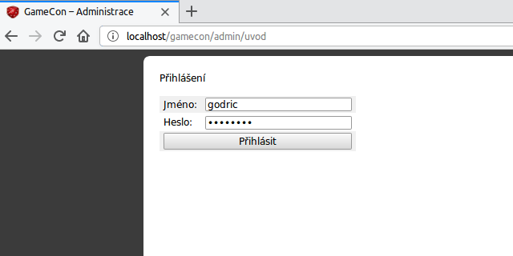

<p align="center">Database migrations without commandline.</p>

## Example



## Configuration

Make sure your database connection has admin rights. If you're using backups, make sure backups directory is not accessible by webserver. Disabling `checkInitialMigrationChanges` is useful for interaction with tests (see below). If you start with empty database or don't test at all, it may be ommited.

For development:

```php
<?php
(new Godric\DbMigrations\DbMigrations([
    'connection'          =>  $myDbConnection,
    'migrationsDirectory' =>  __DIR__ . '/migrations',
    'doBackups'           =>  false,
    'webGui'              =>  true,
    'checkInitialMigrationChanges' => false,
]))->run();
```

For production (no confirmation or webgui):

```php
<?php
if ($_POST['secret'] !== 'my_secret') die(); // protect acces on production

(new Godric\DbMigrations\DbMigrations([
    'connection'          =>  new mysqli('localhost', 'user', 'password', 'database'),
    'migrationsDirectory' =>  __DIR__ . '/migrations',
    'backupsDirectory'    =>  __DIR__ . '/../db-backup',
    'checkInitialMigrationChanges' => false,
]))->run();
```

See all possible configuration options in [configuration class](src/Config.php). Options are read from associative array passed to `DbMigrations` constructor.

## Goal: database migrations with…

- Backup before each migration.
- Editable initial migration.
    - Optional (for test or development): automatic database cleanup and rerun of all migrations on initial migration content change.
    - This is for distributing modified initial migration for tests to other devs.
- Last migration integrity checking.
    - This is to prevent unintentionall edits to migration files.
    - Possibility of restore previous database state (from backup) and rerun migration if edited was rejected. Usual workflow is to edit DB in some GUI (adminer) and copy commands to migration file. This would not work well with autorestore.
- Zero commandline interaction mode.
    - Things should be fast enough to allow checking for new migrations on each request in development enviroments. This way, novice developers will recieve migrations without need to interact with commandline¹.
    - Nice-to-have: some optional basic html UI to handle this workflow in-browser.

_¹ Which is feared by many, even today (especially those coming from Windows™ background)._

## Considerations

- Hacking this type of requirements into [Phinx](https://phinx.org/) would probably mean large rewrite and would interfere with some basic ideas behind Phinx. Therefore I decided to do this as greenfield project (but that decision may be revisited in future).
- This project is intended for small (development) databases.
- This is pure alpha ofc.
